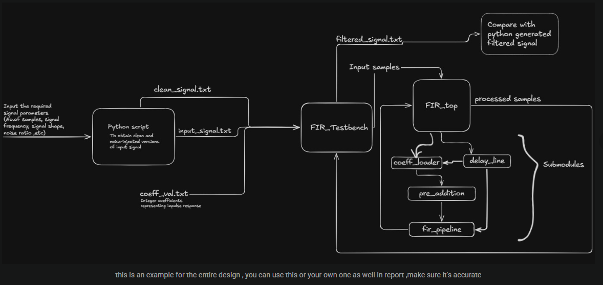
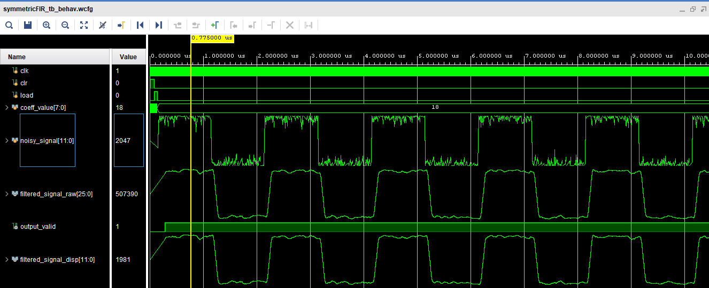
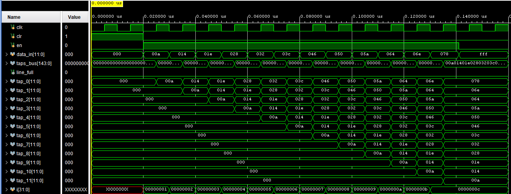
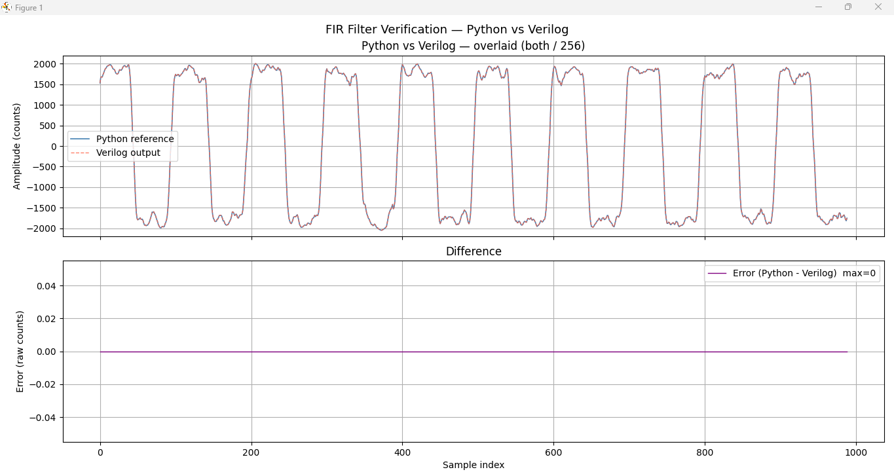

# Symmetric Pipelined FIR Filter in Verilog

A 12-tap symmetric linear-phase low-pass FIR filter implemented in Verilog HDL with a 3-stage pipelined datapath and end-to-end Python verification.

**Status: COMPLETED — max error = 0 (exact match, Python vs Verilog)**

---

## What this is

A digital filter that takes a noisy input signal and smooths it out in real time. Built as part of the IEEE NITK Envision Summer Mentorship Programme 2025-26, DSP Track.

The filter uses coefficient symmetry to cut the number of multiplications from 12 to 6, and pipelines the computation into 3 stages so one new filtered sample comes out every single clock cycle after the initial startup.



---

## Filter Specifications

| Parameter | Value |
|---|---|
| Filter type | Symmetric linear-phase FIR low-pass |
| Number of taps | 12 |
| Coefficients (half) | [6, 12, 22, 30, 34, 24] |
| Full coefficients | [6, 12, 22, 30, 34, 24, 24, 34, 30, 22, 12, 6] |
| DC gain | 256 = 2^8 |
| Cutoff frequency | ~60 Hz at 1000 Hz sample rate |
| Input width | 12-bit signed fixed point |
| Output width | 25-bit signed |
| Pipeline stages | 3 |
| Pipeline latency | 3 clock cycles |
| Throughput | 1 sample per clock cycle |

---

## Architecture

The design is split into 4 modules connected in a pipeline chain:

```
coeff_loader → delay_line → pre_adder → fir_pipeline → data_out
```

Each module only activates after the previous one signals readiness:

```
coeff_valid  →  delay_line enable
line_full    →  pre_adder enable
pre_valid    →  fir_pipeline valid_in
```

### Modules

**coeff_loader.v**
Loads 6 filter coefficients serially one per clock pulse. Asserts `coeff_valid` after all 6 are loaded.

**delay_line.v**
12-tap shift register. New sample enters `tap[0]` every clock cycle, all others shift down. Asserts `line_full` after exactly 12 real samples have been loaded. All 12 taps accessible simultaneously via a packed 144-bit output bus.

**pre_adder.v**
Exploits coefficient symmetry by pre-adding symmetric tap pairs before multiplication:
```
presum[j] = tap[j] + tap[11-j]   for j = 0..5
```
Reduces 12 multiplications to 6.

**fir_pipeline.v**
Two-stage multiply-accumulate pipeline:
- Stage 2: `mul_reg[j] = presum[j] × coeff[j]`
- Stage 3: `data_out = Σ mul_reg[j]`

### Bit Width Tracking

| Stage | Width | Reason |
|---|---|---|
| Input | 12 bits | Raw sample |
| After pre_adder | 13 bits | Sum of two 12-bit values |
| After multiply | 22 bits | 13 + 8 + 1 guard bit |
| After accumulate | 25 bits | 6 products summed |

---

## Pipeline Timing

```
Clock:       N      N+1    N+2    N+3
             ↓       ↓      ↓      ↓
delay_line:  shift
pre_adder:          adds
fir stage2:                muls
fir stage3:                       acc → data_out valid
```

After the initial 3-cycle latency, one valid filtered output is produced every clock cycle permanently.

---

## File Structure

```
├── coeff_loader.v          Serial coefficient loader
├── delay_line.v            12-tap tapped delay line
├── pre_adder.v             Symmetric pair pre-adder
├── fir_pipeline.v          Pipelined multiply-accumulate
├── symmetricFIR.v          Top-level integration module
├── symmetricFIR_tb.v       Vivado testbench
├── gen_noisy_sig_v1.py     Signal generator (original, has tail spike)
├── gen_noisy_sig_v2.py     Signal generator (tail trimmed, zero error)
├── coeff_val.txt           Filter coefficients
└── images/
    ├── block_diagram.png
    ├── vivado_waveform.png
    ├── delay_line_waveform.png
    └── python_vs_verilog.png
```

---

## Results

### Vivado Simulation Waveform



Noisy input signal going in, filtered output clearly smoother. `output_valid` asserts after the pipeline fills up.

### Delay Line Cascade Effect



Values cascading rightward across tap_0 through tap_11 each clock cycle. `line_full` asserts exactly after 12 samples.

### Python vs Verilog Comparison



Python reference and Verilog RTL output overlaid. Max error = 0.

### Delay Line Testbench Results

```
[PASS] T1: async reset correct
[PASS] T2: line_full stayed low during fill
[PASS] T3: line_full asserted after 12 samples
[PASS] T4: tap values correct
[PASS] T5: enable gating correct
[RESULT] PASS - all tests passed
```

---

## How to Run

### Step 1 — Generate input files
```bash
python gen_noisy_sig_v2.py
```
Enter when prompted:
```
Number of samples  : 2000
Signal frequency   : 10
Noise amplitude    : 0.2
Signal type        : square
```

### Step 2 — Copy files to Vivado project folder
- `input_signal_square_2.txt`
- `clean_signal.txt`
- `coeff_val.txt`

### Step 3 — Run simulation in Vivado
1. Set `symmetricFIR_tb` as simulation top
2. Run Simulation → Run Behavioral Simulation
3. In TCL console: `run 2ms`

### Step 4 — Compare with Python reference
Copy `filtered_signal.txt` from the Vivado xsim output folder back here, then:
```bash
python gen_noisy_sig_v2.py --compare
```

---

## About the two Python scripts

**gen_noisy_sig_v1.py** — Original version. Has a spike at the end of the error plot caused by NumPy's `mode='full'` convolution producing tail samples that don't exist in Verilog.

**gen_noisy_sig_v2.py** — Fixed version. Trims those tail samples before comparison. Result: max error = 0 throughout.

---

## Tools

- Verilog HDL
- Xilinx Vivado 2025.2
- Python — NumPy, Matplotlib

---

## IEEE NITK Envision 2025-26 — DSP Track

**Mentors:** Parthip Dev K K, Mula Varun Uthej Reddy, Hardhik Thiriveedi
